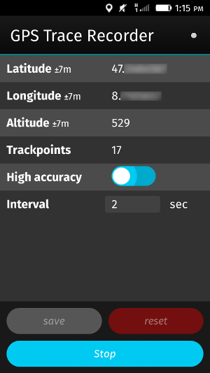
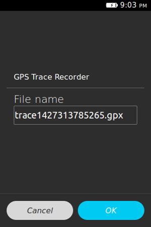

GPS Trace Recorder
==================

Record GPS Traces in GPX format.





The recorded traces will be saved as gpx (xml) file in the root directory of the memory card.


Requirements
------------

### Interfaces

* navigator.getDeviceStorage
* navigator.geolocation


Version history
---------------

Version | Date			| Dependencies								| Features	| Tested with
---		|---			| ---										|---		| ---
1.0		| 2015-03-25	| &bull; lessc 2.2.0<br />&bull; tsc 1.4.1.0<br />&bull; (node 0.10.25)	| &bull; Record GPS Traces<br />&bull; Save recorded traces as gpx<br />&bull; Configure tracking interval<br />&bull; Reset recorded positions | **FxOS Simulator**<br /> &bull; 1.3, 1.4, 2.0 (stable)<br />&bull; 2.1, 2.2, 3.0<br />**Devices**<br />&bull; Mozilla Flame (2.0 pre release)


Compile from source
-------------------

run build.sh to compile code and styles using tsc and lessc of node.js.


### Compile styles by hand

```shell
	lessc ./Resources/Styles/styles.less ./Resources/Styles/styles.css --source-map
```


### Compile TypeScript by hand

```shell
	tsc --target ES5 ./Main.ts --module AMD --out ./Main.js
```


Todo
----

* **Feature**: Show error notifications for geolocation
* **Feature**: Show pending animation until recording
* **Refactoring**: Extract position recorder from TraceFactory
* **Feature**: Localization
